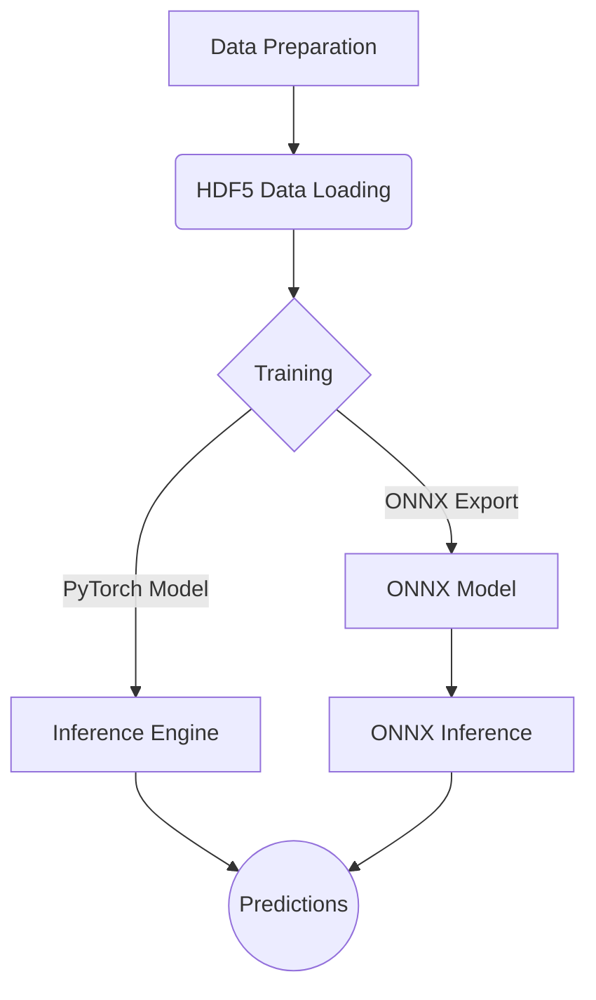

# OppaiOracle

OppaiOracle, also known as **MAID (Model for AI-based Detection)**, is a PyTorch-based system for training, evaluating, and deploying image-tagging models. It supports configuration-driven experimentation, ONNX export, and a suite of utilities for data handling and evaluation.

## Features

-   **Training:** Train custom image tagging models using your own datasets.
-   **Inference:** Run inference with trained models on new images.
-   **ONNX Export:** Export trained models to ONNX format for optimized inference.
-   **Configuration System:** A unified configuration system to manage all aspects of the project.
-   **HDF5 Data Loading:** Efficient data loading using HDF5 files.
-   **Evaluation Tools:** Batch evaluation, live monitoring, and visualization scripts.

## Project Structure

The repository is organized as follows:

```
.
├── configs/              # Configuration files for the model and training process
├── logs/                 # Logs from training and other processes
├── scripts/              # Various utility scripts
├── tools/                # Tools for calibration and other tasks
├── TEst and review/      # Scripts for testing and visualizing results
├── utils/                # Utility functions used across the project
├── Configuration_System.py   # Validates and manages configuration files
├── model_architecture.py # Defines the neural network architecture
├── train_direct.py       # Main training script
├── Inference_Engine.py   # Handles model inference
├── ONNX_Export.py        # Exports the trained model to ONNX format
├── onnx_infer.py         # Runs inference with exported ONNX models
├── HDF5_loader.py        # Loads data from HDF5 files
└── requirements.txt      # Project dependencies
```

## Installation

1.  Clone the repository:
    ```bash
    git clone <repository-url>
    cd <repository-directory>
    ```

2.  Install the required dependencies using pip:
    ```bash
    pip install -r requirements.txt
    ```

## Configuration

The project uses a unified configuration file, `configs/unified_config.yaml`, to manage all settings for the model, training, inference, and more. Before running any scripts, make sure to review and modify this file to suit your needs.

You can validate your configuration using the `Configuration_System.py` script:
```bash
python Configuration_System.py validate configs/unified_config.yaml
```

## Usage

### Training

To train the model, run the `train_direct.py` script with the path to your configuration file:

```bash
python train_direct.py --config configs/unified_config.yaml
```

### Inference

You can run inference using either the PyTorch model or the ONNX model.

-   **PyTorch Inference:**
    ```bash
    python Inference_Engine.py --config configs/unified_config.yaml --vocab vocabulary.json --image /path/to/your/image.jpg
    ```
    The `--vocab` argument defaults to `vocabulary.json` in the project root if not specified.

-   **ONNX Inference:**
    ```bash
    python onnx_infer.py --config configs/unified_config.yaml --image /path/to/your/image.jpg
    ```

## Evaluation

The `TEst and review` directory contains scripts for assessing model performance.

1.  **Run batch evaluation** to generate a JSONL file with results:
    ```bash
    python TEst\ and\ review/batch_evaluate.py \
        --model-path /path/to/your/model.pt \
        --image-dir /path/to/images \
        --json-dir /path/to/json_tags \
        --output /path/to/results.jsonl
    ```

2.  **Monitor progress** while evaluation runs (optional):
    ```bash
    python TEst\ and\ review/live_viewer.py /path/to/results.jsonl
    ```

3.  **Visualize final results** to analyze model performance:
    ```bash
    python TEst\ and\ review/visualize_results.py \
        --results /path/to/results.jsonl \
        --outdir /path/to/visualization_output
    ```

## Workflow

The following diagram illustrates the general workflow of the project:


