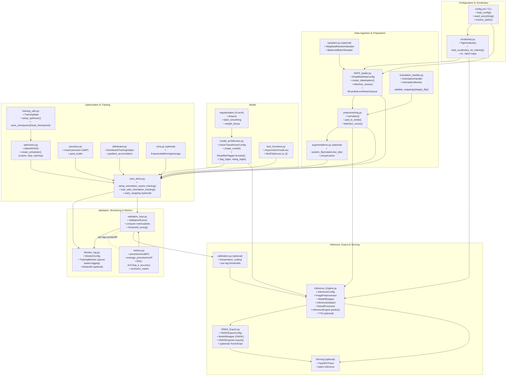

# OppaiOracle

```mermaid
flowchart TD
  %% High-level: config -> data -> model -> training/validation -> inference/export/serve

  subgraph A[Configuration & Vocabulary]
    Config["config.yml / CLI<br/>• load_config()<br/>• seed_everything()<br/>• resolve_paths()"]
    Vocab["vocabulary.py<br/>• TagVocabulary<br/>• load_vocabulary_for_training()<br/>• id↔label maps"]
    Config --> Vocab
  end

  subgraph B[Data Ingestion & Preparation]
    H5["HDF5_loader.py<br/>• SimplifiedDataConfig<br/>• create_dataloaders()<br/>• letterbox_resize()<br/>• BoundedLevelAwareQueue"]
    Pre["preprocessing.py<br/>• normalize()<br/>• pad_to_stride()<br/>• letterbox_resize()"]
    Aug["augmentations.py (optional)<br/>• random_flip/rotate/color_jitter<br/>• mixup/cutmix"]
    Sampler["samplers.py (optional)<br/>• WeightedRandomSampler<br/>• BalancedBatchSampler"]
    Orient["orientation_handler.py<br/>• OrientationHandler<br/>• OrientationMonitor<br/>• validate_mappings()/apply_flip()"]

    Vocab --> H5
    Config --> H5
    H5 --> Pre --> Aug
    Sampler --> H5
    Orient --> Pre
  end

  subgraph C[Model]
    Arch["model_architecture.py<br/>• VisionTransformerConfig<br/>• create_model()<br/>• SimplifiedTagger.forward() -> {tag_logits, rating_logits}"]
    Reg["regularization (in-arch)<br/>• dropout<br/>• label_smoothing<br/>• weight_decay"]
    Losses["loss_functions.py<br/>• AsymmetricFocalLoss<br/>• MultiTaskLoss (α, β)"]

    Reg --> Arch
  end

  subgraph D[Optimization & Training]
    Opt["optimizers.py<br/>• AdamW/SGD<br/>• create_scheduler() (cosine, step, warmup)"]
    AMP["precision.py<br/>• mixed precision (AMP)<br/>• grad_scaler"]
    DDP["distributed.py<br/>• DistributedTrainingHelper<br/>• gradient_accumulation"]
    EMA["ema.py (optional)<br/>• ExponentialMovingAverage"]
    Train["train_direct.py<br/>• setup_orientation_aware_training()<br/>• train_with_orientation_tracking()<br/>• early_stopping (optional)"]
    TUtils["training_utils.py<br/>• TrainingState<br/>• setup_optimizer()<br/>• save_checkpoint()/load_checkpoint()"]

    Arch --> Train
    Losses --> Train
    TUtils --> Opt
    Opt --> Train
    AMP --> Train
    DDP --> Train
    EMA --> Train
  end

  subgraph E[Validation, Monitoring & Metrics]
    Val["validation_loop.py<br/>• ValidationRunner<br/>• compute metrics/plots<br/>• threshold_tuning()"]
    Metrics["metrics.py<br/>• precision/recall/F1<br/>• average_precision/mAP<br/>• ROC-AUC/top_k_accuracy<br/>• confusion_matrix"]
    Mon["Monitor_log.py<br/>• MonitorConfig<br/>• TrainingMonitor (queue-based logging)<br/>• tb/wandb (optional)"]

    Train --> Mon
    Train --> Val
    Metrics --> Val
    Val --> Mon
    Val -. per-tag curves/AP .- Metrics
  end

  subgraph F[Inference, Export & Serving]
    Infer["Inference_Engine.py<br/>• InferenceConfig<br/>• ImagePreprocessor<br/>• ModelWrapper<br/>• InferenceDataset<br/>• ResultProcessor<br/>• InferenceEngine.predict()<br/>• TTA (optional)"]
    Calib["calibration.py (optional)<br/>• temperature_scaling<br/>• per-tag thresholds"]
    Export["ONNX_Export.py<br/>• ONNXExportConfig<br/>• ModelWrapper (ONNX)<br/>• ONNXExporter.export()<br/>• (optional) TorchScript"]
    Serve["Serving (optional)<br/>• FastAPI/Triton<br/>• batch inference"]

    Arch --> Infer
    Vocab --> Infer
    Pre --> Infer
    Val --> Calib --> Infer
    Infer --> Export
    Infer --> Serve
    Export --> Serve
  end

  %% Cross-links
  H5 --> Train
  Pre --> Train
  Aug --> Train
```
