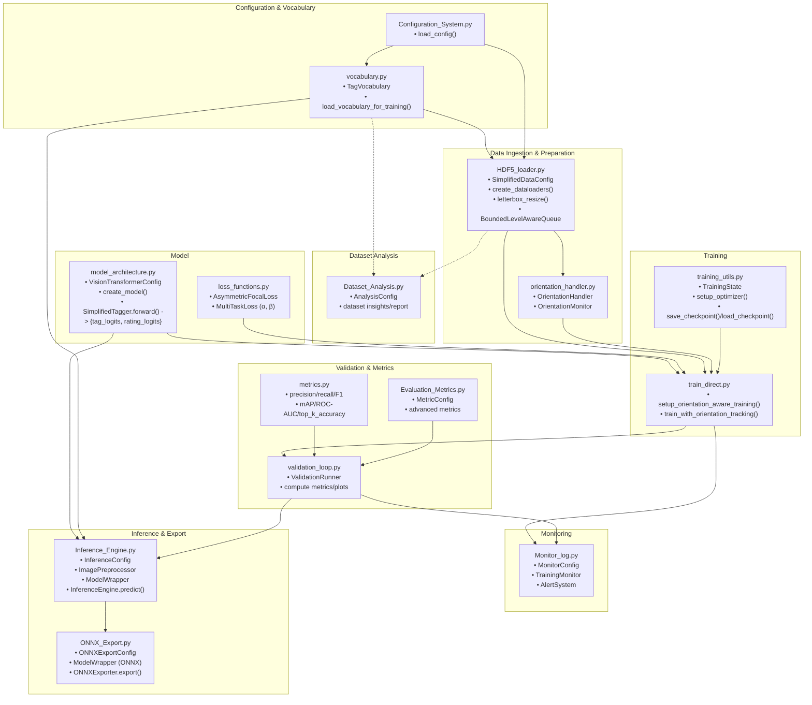

# OppaiOracle

```mermaid
flowchart TD
  %% Configuration & Vocabulary
  subgraph A[Configuration & Vocabulary]
    Config["Configuration_System.py\n• load_config()"]
    Vocab["vocabulary.py\n• TagVocabulary\n• load_vocabulary_for_training()"]
    Config --> Vocab
  end

  %% Data Ingestion & Preparation
  subgraph B[Data Ingestion & Preparation]
    H5["HDF5_loader.py\n• SimplifiedDataConfig\n• create_dataloaders()\n• letterbox_resize()\n• BoundedLevelAwareQueue"]
    Orient["orientation_handler.py\n• OrientationHandler\n• OrientationMonitor"]
    Vocab --> H5
    Config --> H5
    H5 --> Orient
  end

  %% Dataset Analysis
  subgraph H[Dataset Analysis]
    DataA["Dataset_Analysis.py\n• AnalysisConfig\n• dataset insights/report"]
    H5 -.-> DataA
    Vocab -.-> DataA
  end

  %% Model
  subgraph C[Model]
    Arch["model_architecture.py\n• VisionTransformerConfig\n• create_model()\n• SimplifiedTagger.forward() -> {tag_logits, rating_logits}"]
    Losses["loss_functions.py\n• AsymmetricFocalLoss\n• MultiTaskLoss (α, β)"]
  end

  %% Training
  subgraph D[Training]
    Train["train_direct.py\n• setup_orientation_aware_training()\n• train_with_orientation_tracking()"]
    TUtils["training_utils.py\n• TrainingState\n• setup_optimizer()\n• save_checkpoint()/load_checkpoint()"]
    Arch --> Train
    Losses --> Train
    H5 --> Train
    Orient --> Train
    TUtils --> Train
  end

  %% Validation & Metrics
  subgraph E[Validation & Metrics]
    Val["validation_loop.py\n• ValidationRunner\n• compute metrics/plots"]
    Metrics["metrics.py\n• precision/recall/F1\n• mAP/ROC-AUC/top_k_accuracy"]
    AdvM["Evaluation_Metrics.py\n• MetricConfig\n• advanced metrics"]
    Train --> Val
    Metrics --> Val
    AdvM --> Val
  end

  %% Monitoring
  subgraph F[Monitoring]
    Mon["Monitor_log.py\n• MonitorConfig\n• TrainingMonitor\n• AlertSystem"]
    Train --> Mon
    Val --> Mon
  end

  %% Inference & Export
  subgraph G[Inference & Export]
    Infer["Inference_Engine.py\n• InferenceConfig\n• ImagePreprocessor\n• ModelWrapper\n• InferenceEngine.predict()"]
    Export["ONNX_Export.py\n• ONNXExportConfig\n• ModelWrapper (ONNX)\n• ONNXExporter.export()"]
    Arch --> Infer
    Vocab --> Infer
    Val --> Infer
    Infer --> Export
  end
```
