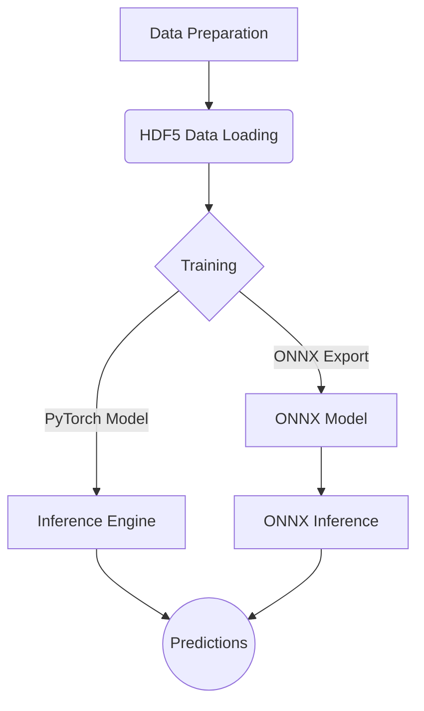

# OppaiOracle

OppaiOracle, is a deep learning project for AI-based image tagging. It is built with PyTorch and is designed to be a comprehensive solution for training, evaluating, and deploying image tagging models.

## Features

-   **Training:** Train custom image tagging models using your own datasets.
-   **Inference:** Run inference with trained models on new images.
-   **ONNX Export:** Export trained models to ONNX format for optimized inference.
-   **FastAPI API:** Serve the model through a REST API using FastAPI.
-   **Configuration System:** A unified configuration system to manage all aspects of the project.
-   **HDF5 Data Loading:** Efficient data loading using HDF5 files.

## Project Structure

The repository is organized as follows:

```
.
├── configs/              # Configuration files for the model and training process
├── logs/                 # Logs from training and other processes
├── maid/                 # Project source code
├── scripts/              # Various utility scripts
├── tools/                # Tools for calibration and other tasks
├── TEst and review/      # Scripts for testing and visualizing results
├── utils/                # Utility functions used across the project
├── model_architecture.py # Defines the neural network architecture
├── train_direct.py       # The main script for training the model
├── Inference_Engine.py   # Handles model inference
├── ONNX_Export.py        # Exports the trained model to ONNX format
├── HDF5_loader.py        # Loads data from HDF5 files
└── requirements.txt      # Project dependencies
```

## Installation

1.  Clone the repository:
    ```bash
    git clone <repository-url>
    cd <repository-directory>
    ```

2.  Install the required dependencies using pip:
    ```bash
    pip install -r requirements.txt
    ```

## Configuration

The project uses a unified configuration file, `configs/unified_config.yaml`, to manage all settings for the model, training, inference, and more. Before running any scripts, make sure to review and modify this file to suit your needs.

You can validate your configuration using the `Configuration_System.py` script:
```bash
python Configuration_System.py validate configs/unified_config.yaml
```

## Usage

### Training

To train the model, run the `train_direct.py` script with the path to your configuration file:

```bash
python train_direct.py --config configs/unified_config.yaml
```

### Inference

You can run inference using either the PyTorch model or the ONNX model.

-   **PyTorch Inference:**
    ```bash
    python Inference_Engine.py --config configs/unified_config.yaml --image /path/to/your/image.jpg
    ```

-   **ONNX Inference:**
    ```bash
    python onnx_infer.py --config configs/unified_config.yaml --image /path/to/your/image.jpg
    ```

### API

The project includes a FastAPI-based API for serving the model. To run the API, use `uvicorn`:

```bash
uvicorn Inference_Engine:app --host 0.0.0.0 --port 8000
```

*(Note: The exact command might vary depending on the API implementation in `Inference_Engine.py`)*

## Workflow

The following diagram illustrates the general workflow of the project:


