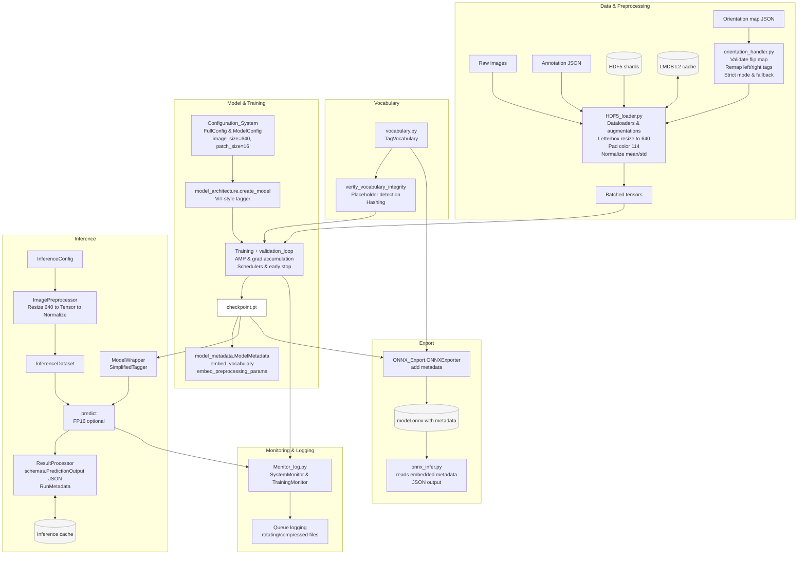

```mermaid
flowchart TD
    %% =========================
    %% DATA & PREPROCESSING
    %% =========================
    subgraph A["Data & Preprocessing"]
        RAW["Raw images"]
        TAGJSON["Annotation JSON"]
        ORIMAP["Orientation map JSON"]
        H5[("HDF5 shards")]
        LMDB[("LMDB L2 cache")]
        HL["HDF5_loader.py<br/>Dataloaders & augmentations<br/>Letterbox resize to 640<br/>Pad color 114<br/>Normalize mean/std"]
        ORH["orientation_handler.py<br/>Validate flip map<br/>Remap left/right tags<br/>Strict mode & fallback"]
        RAW --> HL
        TAGJSON --> HL
        ORIMAP --> ORH 
        ORH --> HL
        H5 --> HL
        LMDB <--> HL
        HL --> BATCH["Batched tensors"]
    end

    %% =========================
    %% VOCABULARY
    %% =========================
    subgraph B["Vocabulary"]
        VOC["vocabulary.py<br/>TagVocabulary"]
        VCHECK["verify_vocabulary_integrity<br/>Placeholder detection<br/>Hashing"]
        VOC --> VCHECK
    end

    %% =========================
    %% MODEL & TRAINING
    %% =========================
    subgraph C["Model & Training"]
        CFG["Configuration_System<br/>FullConfig & ModelConfig<br/>image_size=640, patch_size=16"]
        CREATE["model_architecture.create_model<br/>ViT-style tagger"]
        TRAIN["Training + validation_loop<br/>AMP & grad accumulation<br/>Schedulers & early stop"]
        CKPT["checkpoint.pt"]
        META["model_metadata.ModelMetadata<br/>embed_vocabulary<br/>embed_preprocessing_params"]
        CFG --> CREATE 
        CREATE --> TRAIN
        BATCH --> TRAIN
        VCHECK --> TRAIN
        TRAIN --> CKPT
        CKPT --> META
    end

    %% =========================
    %% INFERENCE
    %% =========================
    subgraph D["Inference"]
        ICONF["InferenceConfig"]
        PREP["ImagePreprocessor<br/>Resize 640 to Tensor to Normalize"]
        WRAP["ModelWrapper<br/>SimplifiedTagger"]
        IDS["InferenceDataset"]
        PRED["predict<br/>FP16 optional"]
        PROC["ResultProcessor<br/>schemas.PredictionOutput JSON<br/>RunMetadata"]
        ICACHE[("Inference cache")]
        CKPT --> WRAP
        ICONF --> PREP
        PREP --> IDS 
        IDS --> PRED 
        PRED --> PROC
        WRAP --> PRED
        PROC <--> ICACHE
    end

    %% =========================
    %% EXPORT
    %% =========================
    subgraph E["Export"]
        ONNXX["ONNX_Export.ONNXExporter<br/>add metadata"]
        ONNXM[("model.onnx with metadata")]
        ORT["onnx_infer.py<br/>reads embedded metadata<br/>JSON output"]
        CKPT --> ONNXX
        VOC --> ONNXX
        ONNXX --> ONNXM
        ONNXM --> ORT
    end

    %% =========================
    %% MONITORING & LOGGING
    %% =========================
    subgraph F["Monitoring & Logging"]
        MON["Monitor_log.py<br/>SystemMonitor & TrainingMonitor"]
        QLOG["Queue logging<br/>rotating/compressed files"]
        TRAIN --> MON
        PRED --> MON
        MON --> QLOG
    end

    %% Styling
    classDef cacheStyle fill:#f5f5f5,stroke:#999,stroke-width:1px
    classDef checkpointStyle fill:#fff,stroke:#333
    
    class LMDB,ICACHE,H5,ONNXM cacheStyle
    class CKPT checkpointStyle
```
